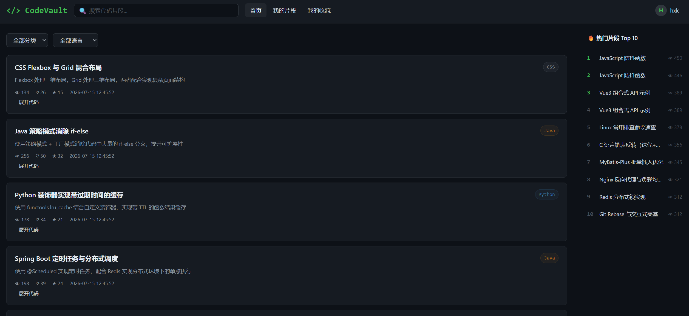
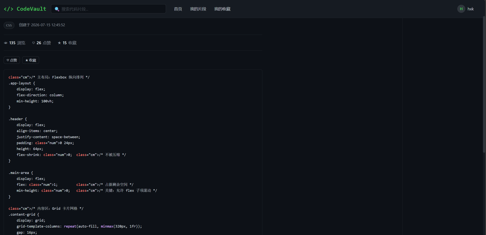

# CodeVault - 在线代码片段管理系统

基于 **Spring Boot 3.2 + MyBatis + MySQL + Redis** 独立设计与开发的后端服务，提供用户认证、代码片段 CRUD、搜索分页、点赞收藏、分类标签管理等核心功能，集成 Swagger 接口文档、AOP 请求日志、Actuator 健康检查，支持 Docker 容器化部署和多环境配置切换。

---

## 项目预览

<table>
<tr>
<td></td>
<td></td>
</tr>
</table>

---

## 技术栈

| 技术                      | 版本      | 作用                       |
| ----------------------- | ------- | ------------------------ |
| Spring Boot             | 3.2.5   | 后端主框架，原生适配 JDK 17        |
| MyBatis                 | 3.0.3   | ORM 框架，XML 映射管理复杂 SQL    |
| MySQL                   | 8.0     | 关系型数据库，7 张表含多对多关联        |
| Redis                   | 7       | 热门片段缓存，30 分钟 TTL         |
| JWT (jjwt)              | 0.12.6  | 无状态身份认证，使用 HMAC-SHA256   |
| Swagger/OpenAPI         | 2.3.0   | 自动生成接口文档                 |
| Docker + Docker Compose | -      | 一键编排 MySQL + Redis + App |
| Lombok                  | 1.18.30 | 简化实体类开发                  |

---

## 核心功能

- **用户模块**：注册/登录，JWT 鉴权，BCrypt 密码加密，密码字段不返回前端（@JsonIgnore）
- **代码片段管理**：创建/编辑/删除/逻辑删除，支持公开/私有设置
- **搜索与筛选**：关键词模糊搜索（title + description）、分类筛选、编程语言筛选，合理使用索引
- **热门排行**：按浏览量降序，Redis 缓存热门列表，写操作自动清除缓存保证一致性
- **互动功能**：点赞/取消点赞、收藏/取消收藏、我的收藏列表（分页）
- **分类标签**：多对多关联，创建片段时自动查找或创建标签
- **权限控制**：JWT 拦截器区分公开/私有接口，用户只能操作自己的数据

---

## 技术亮点

### 1. 分层架构与统一规范

Controller-Service-Mapper 三层分离，**Service 层返回纯业务对象，Controller 层统一包装 `Result<T>`**，职责清晰，Service 可独立测试。全局异常处理 `GlobalExceptionHandler`，业务异常与系统异常分层处理，生产环境异常信息脱敏。

### 2. JWT 无状态认证（jjwt 0.12.x）

使用 `Keys.hmacShaKeyFor()` 安全构建密钥，自定义 `JwtInterceptor` 拦截器，从 `Authorization: Bearer <token>` 头中提取并验证 JWT，有效则将 `userId` 注入 request attribute。公开接口白名单放行，Swagger 文档中自动标注哪些接口需要登录。

### 3. Redis 缓存策略

- 缓存 key：`hot_snippets`，缓存前 10 条热门片段
- TTL：30 分钟，缓存未命中自动从数据库刷新
- 数据一致性：片段创建/更新/删除后主动调用 `clearCache()` 清除缓存

### 4. 数据库设计与优化

- 7 张表：用户、分类、标签、代码片段、片段-标签关联、点赞、收藏
- 代码片段表建立 4 个索引：`user_id`、`category_id`、`language`、`create_time`
- 点赞/收藏使用 `GREATEST(count - 1, 0)` 防止计数为负

### 5. 批量查询优化（解决 N+1 问题）

标签查询使用 `TagMapper.findBySnippetIds()` 批量 IN 查询 + 内存分组装配，替代原有的循环逐条查询。涉及列表查询的接口（公开片段、热门片段、我的片段、我的收藏）均已优化。

### 6. 事务管理

片段创建/更新涉及多张表操作（snippet + snippet_tag），使用 `@Transactional(rollbackFor = Exception.class)` 保证原子性。

### 7. AOP 全局请求日志

`WebLogAspect` 切面拦截所有 Controller 方法，记录请求 URL、HTTP 方法、客户端 IP、入参、响应结果和执行耗时，支持反向代理（X-Forwarded-For）IP 识别。

### 8. 参数校验

DTO 使用 Jakarta Validation 注解（`@NotBlank`、`@Size`），Controller 方法参数使用 `@Validated`，配合 `GlobalExceptionHandler` 自动返回校验错误信息。

### 9. Swagger/OpenAPI 接口文档

所有 19 个接口均添加了 Swagger 注解，支持在线调试和 Bearer Token 认证，访问 `/swagger-ui.html` 即可查看完整文档。

### 10. Spring Boot Actuator 健康检查

暴露 `/actuator/health` 端点，开发环境显示详细健康信息，生产环境按需暴露。

### 11. 多环境配置分离

- `application-dev.yml`：开发环境，打印 SQL 日志
- `application-prod.yml`：生产环境，连接池优化，配置项通过环境变量注入

### 12. Docker 容器化

Dockerfile 打包应用镜像，docker-compose.yml 编排 MySQL 8.0 + Redis 7 + App，实现一键启动。

---

## API 概览

| 模块   | 接口数量 | 典型接口             |
| ---- | ---- | ---------------- |
| 用户   | 2    | 注册、登录（返回 JWT）    |
| 代码片段 | 6    | 公开搜索分页、热门排行、CRUD |
| 分类   | 4    | 查询、增删改（管理员）      |
| 标签   | 2    | 查询、创建            |
| 互动   | 5    | 点赞、收藏、取消、我的收藏    |

总计 **19 个 RESTful API**，Swagger 在线文档自动生成。

---

## 数据库关系

```
user (1) ----< snippet (N) ----> category (1)
              |
              |----< snippet_tag >---- tag (N)
              |
              |----< like >---- user (N)
              |
              |----< collection >---- user (N)
```

---

## 项目结构

```
code-vault/
├── .github/workflows/
│   └── ci.yml                     # GitHub Actions CI 流水线
├── sql/
│   ├── init.sql                   # 数据库建表脚本 + 初始数据
│   └── test-data.sql              # 测试演示数据（10条片段）
├── docker/
│   ├── Dockerfile                 # 应用镜像
│   └── docker-compose.yml         # 一键编排
├── src/
│   ├── main/java/com/codevault/
│   │   ├── controller/            # 5 个控制器（含 Swagger 注解）
│   │   ├── service/               # 4 个服务接口 + 实现
│   │   ├── mapper/                # 6 个 MyBatis Mapper
│   │   ├── entity/                # 6 个实体类
│   │   ├── dto/                   # 3 个请求参数 DTO
│   │   ├── config/                # Web/Redis/缓存/Swagger/AOP配置
│   │   ├── interceptor/           # JWT 认证拦截器
│   │   ├── common/                # 统一响应 + 全局异常
│   │   └── utils/                 # JWT 工具类
│   └── main/resources/
│       ├── application.yml        # 主配置（切换 dev/prod）
│       ├── application-dev.yml    # 开发环境配置
│       ├── application-prod.yml   # 生产环境配置
│       └── mapper/                # 6 个 MyBatis XML 映射文件
└── src/test/java/com/codevault/
    └── service/                   # 单元测试（Mockito）
```

---

## 单元测试

使用 JUnit 5 + Mockito 进行核心业务逻辑测试：

- `UserServiceTest`：注册成功/用户名重复、登录成功/用户不存在/密码错误/账号禁用
- `SnippetServiceTest`：创建成功/失败、更新成功/无权修改、删除成功/不存在、私密片段不可查看、分页查询
- `TagServiceTest`：查询所有、创建新标签/已存在返回/空名称校验

运行测试：
```bash
mvn test
```

---

## 本地启动

```bash
# 1. 创建数据库并执行 sql/init.sql
# 2. （可选）执行 sql/test-data.sql 插入演示数据
# 3. 修改 application-dev.yml 中的数据库密码
# 4. 启动 Redis
# 5. 编译运行
mvn compile
mvn spring-boot:run

# 访问 Swagger 文档
# http://localhost:8080/swagger-ui.html

# 或 Docker 一键启动
cd docker
docker-compose up -d
```

---

## 开发时间线

- 核心功能开发：用户认证、片段 CRUD、分类标签管理、搜索分页
- 功能完善：集成 Redis 缓存、AOP 请求日志、Swagger 文档、Docker 容器化
- 代码优化：修复 N+1 查询、Service 层解耦 Result 包装、JWT 升级至 0.12.x
- 质量保障：补充单元测试、添加 GitHub Actions CI、参数校验完善

## License

[MIT](LICENSE)
